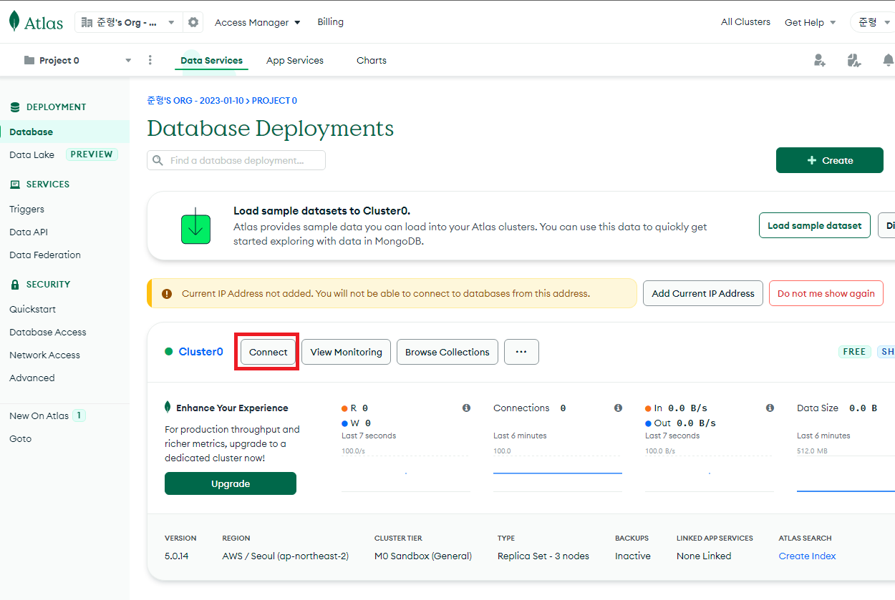
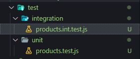

# 01. 강의 소개 & 어플리케이션 기본 구조

## 01-01. 강의 소개

**TDD (Test Driven Development)**를 이용한 node.js 어플리케이션 개발.

Test 주도의 개발.


**왜 Test를 해야할까?**

더 안정적인 어플리케이션  개발을 위해.


**이점은?**

1. 디버깅 시간 단축<br/> - 테스팅 환경이 구축되있다면 자동화된 유닛 테스팅으로 특정 버그를 쉽게 찾아낼 수 있다.
2. 더욱 안정적인 어플리케이션!
3. 이밖의 재설계 시간 단축.<br/> - 추가로 무언가 더 구현 시 용이.


**할 것은?**

CRUD를 개발해보면서 테스트 작성예정.

각 과정 개발 시 `단위테스트 -> CRUD -> 통합테스트`로 진행 예정.


## 01-02. Node.js 설치

[Node.js](https://nodejs.org/ko/)

LTS버전으로 설치.

설치 후 아래 명령어로 버전 확인하기.

```shell
node -v
```


## 01-03. package.json파일 작성하기

node.js 기본 구조 코드 작성

처음에 package.json를 만들고, entry포인트가 되는 server.js를 만듬.

폴더 생성 후 package.json생성

> **package.json**
>
> 프로젝트의 정보와 프로젝트에서 사용중인 패키지의 **의존성을 관리**하는 곳.
>
> `npm init`으로 생성.

**npm init**


**사용할 라이브러리 설치**

```shell
npm install express mongoose --save
npm install jest supertest node-mocks-http --save -dev
```

`--dev`는 개발환경에서만 사용한다는 뜻.

* Express <br/>Node.js의 API를 단순화 하고 유용한 기능들은 더 추가해 더 편리하고 유용하게 사용할 수 있게 해주는 모듈
* Mongoose<br/>MongoDB를 편리하게 사용하게 해주는 노드의 확장 모듈
* Jest<br/>단위 테스트를 위한 모듈
* node-mocks-http<br/>단위 테스트를 위한 모듈
* supertest<br/>통합 테스트를 위한 모듈


## 01-04. server.js 파일 작성하기

`server.js`는 `Node.js`의 **진입점**이 되는 파일

```javascript
// server.js
const express = require('express'); // Express 모듈 불러오기

// Constants
const PORT = 8080; // Express 서버를 위한 포트 설정
const HOST = '0.0.0.0'; // 호스트 지정

// App
const app = express(); // 새로운 Express 어플 생성
app.get('/', (req, res) => { // '/'로 요청이 오면 Hello World를 전달
    res.send('Hello World');
})

app.listen(PORT, HOST); // 해당 포트와 호스트에서 HTTP서버를 시작
console.log(`Running on http://${HOST}:${PORT}`);

```


## 01-05. express.json()

**Example**

```javascript
// Front
axios.post('/products', {
    name: 'phone', description: 'it's new';
})

// Back
const express = require('express');
const app = express();
app.post('/products', (req, res)=>{
    console.log('req.body : ', req.body); // undefined가 출력됨.
})
```

undefined값은 `bodyParser`모듈을 이용해 해결해 줄 수 있다.

express 4.16.0이상 부터는 `express내장 미들웨어 함수`로 **bodyParser모듈을 대체**해 줄 수 있다.

현 버전 : 4.18.2

```javascript
// Front
axios.post('/products', {
    name: 'phone', description: 'it's new';
})

// Back
const express = require('express');
const app = express();
app.use(express.json())

app.post('/products', (req, res)=>{
    console.log('req.body : ', req.body); 
})
```


## 01-06. route, controller 생성

api가 많아지면, 관리하기가 어려워져서 서비스에 맞게 관리하기 위해서 필요함.

route와 controller는 아래 사진처럼 2가지 방법으로  사용해볼 수 있다.


### Route 구현 방법

1.express.Router 클래스를 이용해 Router를 모듈로 작성

```javascript
const router = express.Router();
```

2.Router에서 미들웨어 함수를 Load하기.

```javascript
router.get('/', function(req, res){
    res.send('Birds home page');
})
```

3.몇몇 Route를 정의.

4.기본앱의 한 경로에 라우터 모듈을 마운트하기.

여기서 예제의 경우 기본앱은 `server.js`

```javascript
const birds = require('./birds');
...
app.use('/birds', birds);
```


`server.js`에서 받기 위해 route.js에서 작성한 router를 export해주어야 한다.

```javascript
// route.js
...
module.exports = router;
```

```javascript
// server.js
...
// App
const app = express(); // 새로운 Express 어플 생성
const productRoutes = require('./routes');
app.use("/api/products", productRoutes);
...
```

```shell
npm run start
```

위 명령어로 실행시킨 후 브라우저에서 설정해준 `/api/products`경로로 이동하게 되면, routes.js에서 작성한 내용이 출력되는 것을 볼 수 있다.


❗ 만약 route파일을 분리한다면, 폴더를 따로 생성해서 그안에서 작성해 나가는 것이 좋다.


### Controller 구현 방법

1.Router에 구현한 미들웨어 함수 부분을 떼어서 Controller 파일에 옮겨줌.

2.Controller에 넘어간 **미들웨어 함수를 Export하고, Route에서 import** 해줌.

> 미들웨어 함수가 어디?
>
> ```javascript
> // routes.js
> router.get('/', (req, res)=>{
>   res.send("안녕하세요!");
> })
> ```
>
> 위 코드에서 `(req, res)=> {...}` 부분이다.

```javascript
// controller/products.js
exports.hello = (req, res)=>{
  res.send("안녕하세요!");
}
```

```javascript
// routes.js
const express = require('express');
const router = express.Router();
const productController = require('./controller/products');
router.get('/', productController.hello)

module.exports = router;
```


## 01-07. MongoDB클러스터 생성

MongoDB 클러스터 생성

1. MongoDB사이트 회원가입
2. Cluster(클러스터) 만들기
3. 몽고DB 유저 생성<br/>❗ 아이디, 비번, DB이름 기억 
4. Mongoose알아보기
5. Mongoose다운로드<br/>`npm install mongoose --save`
6. App에 MongoDB연결
7. 확인.

[MongoDB 사이트](https://www.mongodb.com/)

Free 버전으로 클러스터를 생성하고, 몽고 DB유저를 생성.

npm install후에 server.js를 아래처럼 작성

```javascript
// server.js
...
const mongoose = require('mongoose');
mongoose.connect(`${your connect Url}`, {
    useNewUrlParser: true,
}).then(()=> console.log('MongoDb Connected ...'))
.catch(err => console.log(err));
...
```

connect의 내용은 생성한 Cluster의 connect를 누른 후 `Connect your application`란에서 확인이 가능



`npm run start` 후 console이 입력되는 것을 볼 수 있따.


## 01-08. 몽구스 Model, Schema 생성

**몽구스(mongoose)란?**

몽고 DB 사용을 위한 다양한 기능을 추가하고, 몽고DB를 더 편리하게 이용하기 위해서 사용하는 모듈

몽구스를 이용해 데이터를 만들고 관리하기 위해서 먼저 **schema를 만들고 schema로 모델을 만든다.**

몽고 DB는  JSON형식, Node.js는 Javscript.

> 다른 DB와 몽고DB차이
>
> Tables - Collections
>
> Rows - Documents
>
> Columns - Field

Node.js에서 User Collection과 Document에 접근? => 몽구스가 해결해준다.

몽구스가 `Model Class`와 `Model Instance`를 제공해준다.

* Model Class -> Collection
* Model Instance -> Documents


**Schema?**

Mongoose스키마는 `문서(Document)의 구조`, `기본값`, `유효성 검사기` 등을 **정의**함.

기본값 -> defaults: 0

유효성 검사 -> required: ture


**Model?**

Mongoose 모델은 `레코드 생성`, `쿼리`, `업데이트`, `삭제`등을 위한 데**이터베이스 인터페이스를 제공**


models폴더를 생성하고, Product.js폴더를 만들자.

```javascript
const productSchema = new mongoose.Schema({
    name: {
        type: String,
        required: true,
    },
    description: {
        type: String,
        required: true,
    },
    price: {
        type: Number
    }
});

const Product = mongoose.model("Product", productSchema)
module.exports = Product
```


## 01-09. 단위 테스트

**단위(Unit) 테스트란?**

개발자가 수행하고 자신이 개발 한 코드 단위 (모듈, 구성요소)를 테스트함.

소스 코드의 **`개별 단위`를 테스트**하여 사용할 준비가 되었는지 확인하는 테스트 방법.

개발 라이프 사이클 초기 단계에서 버그가 식별되 버그 수정 비용을 줄이는데 도움됨.

간단하게 메서드를 테스트하는 또다른 메서드라 생각.


**❗ 단위(Unit)테스트의 조건**

1. 독립적이어야 하며, **어떤 테스트도 다른 테스트에 의존하지 않아야함.**
2. 격리되어야함.<br/>Ajax, Axios, LocaStorage등 테스트 대상이 의존하는 것을 다른 것으로 대체해야함.


**why?**

왜 단위 테스트를 해야할까?

1. 프로그램이 크고, 메모리가 많이 들고, 다른 리소스가 필요한 경우 로컬 환경에서 쉽게 코드를 실행시켜보기 어렵다.<br/>이런 경우 개발자들은 유닛테스트를 만들어 빠르게 자신의 코드를 확인해볼 수 있다.
2. 종속성이 있는 다른 클래스들에서 버그가 나는것을 방지하기 위해서.<br/>A에서 버그가 발생하는게 공통 Class에서 에러가 발생한 에러인 경우 수정했더니 A는 사라졌지만, 공통 Class를 사용하는 C에서 발생할 수 있다.<br/>C 수정 후 다시 A에서 발생할 수도 있다.<br/>=> 유닛테스트를 통해 버그 발생을 방지할 수 있다.


## 01-10. Jest

**Jest란?**

FaceBook에서 만들어진 테스팅 프레임 워크.

최소한의 설정으로 동작하며, Test Case를 만들어 어플리케이션 코드가 잘 돌아가는지 확인해줌.

**단위(Unit)테스트를 위해 이용**


**Jest 시작**

1. Jest 라이브러리 설치<br/>`npm install jest --save-dev`
2. Test 스크립트 변경<br/>`"test": "jest" or "jest --watchAll"`
3. 테스트 작성할 폴더 및 파일 기본 구조 생성

2번의 경우 pacakge.json의 test부분에 jest를 추가.

`npm test`를 실행하면 jest가 동작하는 것을 볼 수 있다.


**Jest가 테스트를 찾는방법**

* {filename}.test.js
* {filename}.spec.js
* tests폴더 안의 모든 파일들

**파일 구조**

* Test -> 단위테스트 폴더 (Unit Test) -> 단위 테스트 파일 `<대상 이름>.test.js`

* Test -> 통합 테스트 (Integration Test) -> 통합 테스트 `<대상 이름>.test.int.js`

아래 사진처럼 구조를 잡아 진행




## 01-11. Jest파일 구조 및 사용법

**Jest파일 구조**

describe안에 test케이스들을 하나하나 넣는 구조

(test와 it는 같은 뜻)

* **describe**<br/>여러 관련 테스트를 **그룹화** 하는 블록을 만든다.
* **test (it)**<br/>**개별 테스트**를 수행하는 곳. 각 테스트를 작은 문장처럼 설명함

```javascript
describe("Product Controller create", ()=>{
    beforeEach(()=>{
        req.body = newProduct;
    });
    it("should have a createProduct function", ()=>{
        expect(typeof productController.createProduct).toBe("function")
    });
    it("should call Product.create", async()=>{
        await ProductController.createProduct(req, res, next);
        expect(Product.create).toBeCalledWith(newProduct)
    });
    ...
})
```

expect와 다른 것(toBe, toBeCalledWith, ....)들이 뒤에 붙는 걸 볼수 있는데 이것들을 matcher라고 한다.

**expect**

expect함수는 값을 테스트할 때 마다 사용됨.

expect함수는 혼자서 거의 사용되지 않으며 matcher와 함꼐 사용됨.

**matcher**

**다른 방법**으로 값을 테스트하도록 `매처`를 사용함.

```javascript
// product.test.js
test('two plus two is four', ()=>{
  expect(2 + 2).toBe(4);
})

test('two plus two is not five', ()=>{
  expect(2 + 2).not.toBe(5);
})
```

위 코드를 작성하고, `npm test`를 해보면 잘 통과하는 것을 볼 수 있다.


## 01.12 jest.fn()

**jest.fn()이란?**

단위테스트가 다른 부분에 의존적이지 않기 위해 사용.

Mock함수를 생성하는 함수.

단위 테스트를 작성할 때 해당 코드가 **의존하는 부분을 가짜로 대체**하는 일을 해줌.


**왜 단위테스트는 독립적이어야 하나?**

의존적인 부분을 구현하기 까다로울 경우가 있으며,

의존적인 부분의 상태에 따라서 테스트하고자 하는 부분의 테스트 결과가 영향을 받을 수 있다.


**❗ 단위 테스트는 특정 기능만 분리해서 독립적으로 사용!**

jest.fn()을 이용해 가짜 함수를 생성하므로 인해 의존적인 부분으로 인해 영향을 받는 테스트 상황을 해결 할 수 있다.

가짜 함수는 이 함수에 어떤 일들이 발생했는지, 다른 코드들에 의해 어떻게 호출되는지를 기억하기 때문에 함수가 내부적으로 어떻게 사용되는지 검증할 수 있다. (Spy 역할)


**jest.fn() 기본 사용법**

* Mock 함수 생성
* 가짜 함수 호출 인자를 넘겨 호출 가능
* 가짜 함수가 어떤 결과값을 반환 할지 직접 알려주기
* 가짜 함수가 몇번 호출되었고 어떤 인자가 넘어왔는지 검증

```javascript
const mockFunction = jest.fn() // Mock 함수 생성

// 가짜 함수 호출. 인자를 넘겨서도 가능
mockFunction()
mockFunction('hello')

mockFunction.mockReturnValue("가짜 함수 반환") // 반환값을 정해줌
cosnole.log(mockFunction) // 가짜 함수 반환

mockFunction('hello')
mockFunction()

expect(mockFunction).toBeCalledWith('hello')
expect(mockFunction).toBeCalledWith(2)
```

