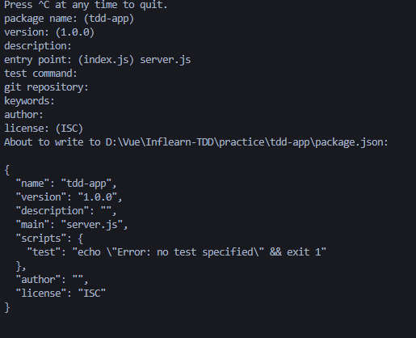
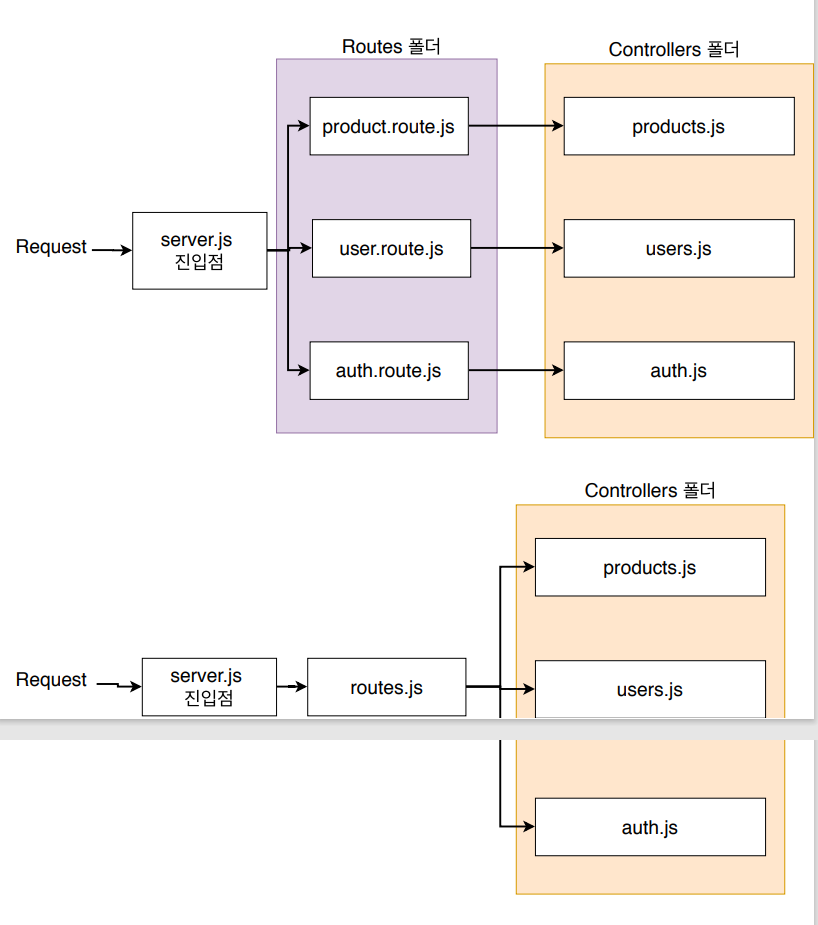
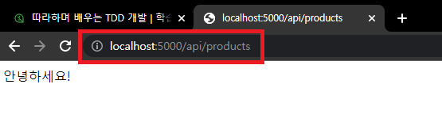

# 01. 강의 소개 & 어플리케이션 기본 구조

## 01-01. 강의 소개

**TDD (Test Driven Development)**를 이용한 node.js 어플리케이션 개발.

Test 주도의 개발.


**왜 Test를 해야할까?**

더 안정적인 어플리케이션  개발을 위해.


**이점은?**

1. 디버깅 시간 단축<br/> - 테스팅 환경이 구축되있다면 자동화된 유닛 테스팅으로 특정 버그를 쉽게 찾아낼 수 있다.
2. 더욱 안정적인 어플리케이션!
3. 이밖의 재설계 시간 단축.<br/> - 추가로 무언가 더 구현 시 용이.


**할 것은?**

CRUD를 개발해보면서 테스트 작성예정.

각 과정 개발 시 `단위테스트 -> CRUD -> 통합테스트`로 진행 예정.


## 01-02. Node.js 설치

[Node.js](https://nodejs.org/ko/)

LTS버전으로 설치.

설치 후 아래 명령어로 버전 확인하기.

```shell
node -v
```


## 01-03. package.json파일 작성하기

node.js 기본 구조 코드 작성

처음에 package.json를 만들고, entry포인트가 되는 server.js를 만듬.

폴더 생성 후 package.json생성

> **package.json**
>
> 프로젝트의 정보와 프로젝트에서 사용중인 패키지의 **의존성을 관리**하는 곳.
>
> `npm init`으로 생성.

**npm init**



**사용할 라이브러리 설치**

```shell
npm install express mongoose --save
npm install jest supertest node-mocks-http --save -dev
```

`--dev`는 개발환경에서만 사용한다는 뜻.

* Express <br/>Node.js의 API를 단순화 하고 유용한 기능들은 더 추가해 더 편리하고 유용하게 사용할 수 있게 해주는 모듈
* Mongoose<br/>MongoDB를 편리하게 사용하게 해주는 노드의 확장 모듈
* Jest<br/>단위 테스트를 위한 모듈
* node-mocks-http<br/>단위 테스트를 위한 모듈
* supertest<br/>통합 테스트를 위한 모듈


## 01-04. server.js 파일 작성하기

`server.js`는 `Node.js`의 **진입점**이 되는 파일

```javascript
// server.js
const express = require('express'); // Express 모듈 불러오기

// Constants
const PORT = 8080; // Express 서버를 위한 포트 설정
const HOST = '0.0.0.0'; // 호스트 지정

// App
const app = express(); // 새로운 Express 어플 생성
app.get('/', (req, res) => { // '/'로 요청이 오면 Hello World를 전달
    res.send('Hello World');
})

app.listen(PORT, HOST); // 해당 포트와 호스트에서 HTTP서버를 시작
console.log(`Running on http://${HOST}:${PORT}`);

```


## 01-05. express.json()

**Example**

```javascript
// Front
axios.post('/products', {
    name: 'phone', description: 'it's new';
})

// Back
const express = require('express');
const app = express();
app.post('/products', (req, res)=>{
    console.log('req.body : ', req.body); // undefined가 출력됨.
})
```

undefined값은 `bodyParser`모듈을 이용해 해결해 줄 수 있다.

express 4.16.0이상 부터는 `express내장 미들웨어 함수`로 **bodyParser모듈을 대체**해 줄 수 있다.

현 버전 : 4.18.2

```javascript
// Front
axios.post('/products', {
    name: 'phone', description: 'it's new';
})

// Back
const express = require('express');
const app = express();
app.use(express.json())

app.post('/products', (req, res)=>{
    console.log('req.body : ', req.body); 
})
```


## 01-06. route, controller 생성

api가 많아지면, 관리하기가 어려워져서 서비스에 맞게 관리하기 위해서 필요함.

route와 controller는 아래 사진처럼 2가지 방법으로  사용해볼 수 있다.




### Route 구현 방법

1.express.Router 클래스를 이용해 Router를 모듈로 작성

```javascript
const router = express.Router();
```

2.Router에서 미들웨어 함수를 Load하기.

```javascript
router.get('/', function(req, res){
    res.send('Birds home page');
})
```

3.몇몇 Route를 정의.

4.기본앱의 한 경로에 라우터 모듈을 마운트하기.

여기서 예제의 경우 기본앱은 `server.js`

```javascript
const birds = require('./birds');
...
app.use('/birds', birds);
```


`server.js`에서 받기 위해 route.js에서 작성한 router를 export해주어야 한다.

```javascript
// route.js
...
module.exports = router;
```

```javascript
// server.js
...
// App
const app = express(); // 새로운 Express 어플 생성
const productRoutes = require('./routes');
app.use("/api/products", productRoutes);
...
```

```shell
npm run start
```

위 명령어로 실행시킨 후 브라우저에서 설정해준 `/api/products`경로로 이동하게 되면, routes.js에서 작성한 내용이 출력되는 것을 볼 수 있다.



❗ 만약 route파일을 분리한다면, 폴더를 따로 생성해서 그안에서 작성해 나가는 것이 좋다.


### Controller 구현 방법

1.Router에 구현한 미들웨어 함수 부분을 떼어서 Controller 파일에 옮겨줌.

2.Controller에 넘어간 **미들웨어 함수를 Export하고, Route에서 import** 해줌.

> 미들웨어 함수가 어디?
>
> ```javascript
> // routes.js
> router.get('/', (req, res)=>{
>   res.send("안녕하세요!");
> })
> ```
>
> 위 코드에서 `(req, res)=> {...}` 부분이다.

```javascript
// controller/products.js
exports.hello = (req, res)=>{
  res.send("안녕하세요!");
}
```

```javascript
// routes.js
const express = require('express');
const router = express.Router();
const productController = require('./controller/products');
router.get('/', productController.hello)

module.exports = router;
```

