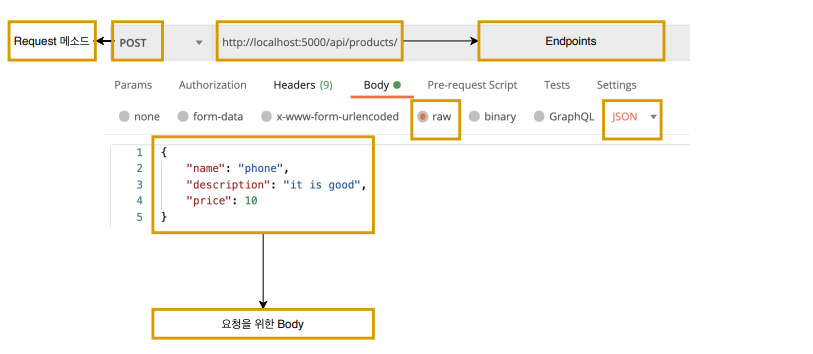
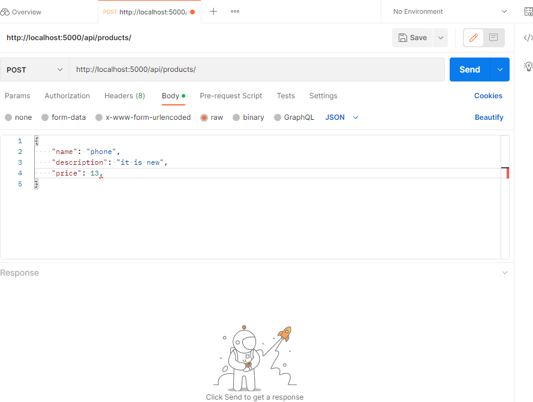
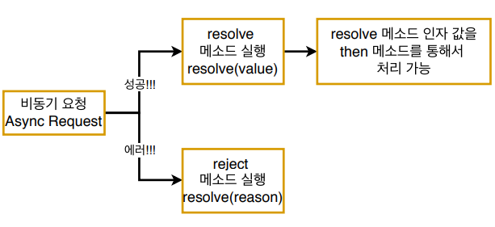

# 03. Create 에러 처리

## 03-01. 포스트맨 설치

**포스트맨**

개발한 API를 테스트하고, 결과를 공유하여 API개발의 생산성을 높여주는 플랫폼.

API요청을 전달하는 클라이언트가 없으므로 포스트맨으로 임의로 전달해볼 예정.


**설치 & 사용**

[postman 설치링크](https://www.postman.com/downloads/)


※ 자세한 사용방법은 검색해서 알아보자.




## 03-02. 임의로 데이터를 저장할 때 만나는 문제점

포스트맨을 이용해 임의로 새로운 product를 db에 저장해주자.

아래 사진처럼 url과 body를 입력하고 `npm run start`로 서버 실행후 send!




**결과**

```json
...
<body>
	<pre>Cannot POST /api/products/</pre>
</body>
...
```

server.js에 설정해둔 서버로 잘 설정되있지만, routes.js에 분기처리가 없기 때문에 발생.

routes.js를 수정하자.

```javascript
// server.js
// App
const app = express(); // 새로운 Express 어플 생성
const productRoutes = require('./routes');
...
app.use("/api/products", productRoutes);

//-------------------------------------------------------------------------------

// routes.js
...
router.post('/', productController.createProduct)

module.exports = router;
```

이제 server.js에서 설정해둔 `app.use("/api/products", productRoutes);`를 통해 router로 가서 url에 맞는 controller로 가게 될 것이다.

send를 하게 되면 아래와 같은 결과를 확인할 수 있다.

`createdProduct Promise { <pending> }`


## 03-03. async await

왜 `Promise {<pending>}`이라고 나왔을까?

**정답은 데이터를 저장할 때 비동기로 하기 때문!**


동기는 하나하나 순서대로, 비동기는 1과 2가 같이 요청되고, 서로 상관없이 결과를 리턴함.

```javascript
// controller/prodcuts.js
const productModel = require('../models/Products');
exports.createProduct = (req, res, next) =>{
  const createdProduct = productModel.create(req.body);
  console.log('createdProduct', createdProduct);
  res.status(201).json(createdProduct);
}
```

코드를 다시 보면, request1이 끝나기 전에 console.log를 찍었기 때문에 Promise안에 pending이라고 나온 것.


**해결방법?**

Response가 오지 않은 상태가 아닌 결과값을 받은 후에 값을 처리해주면 된다.

**`.then()`**

```javascript
// controller/prodcuts.js
const productModel = require('../models/Products');
exports.createProduct = (req, res, next) =>{
  const createdProduct = productModel.create(req.body).then(resposne=>{
	  console.log('createdProduct', createdProduct);      
      res.status(201).json(createdProduct);
  });
}
```


**`async await`**

```javascript
// controller/prodcuts.js
const productModel = require('../models/Products');
exports.createProduct = async (req, res, next) => {
  const createdProduct = await productModel.create(req.body)
  console.log('createdProduct', createdProduct);      
  res.status(201).json(createdProduct);
}
```


❗ 단위테스트코드도 수정해주어야 한다.

```javascript
// test/unit/product.test.js
it("should call ProductModel.create",  async () => {
    await productController.createProduct(req, res, next);
    expect(productModel.create).toBeCalledWith(newProduct);
});

it("should return 201 response code", async ()=>{
    await productController.createProduct(req, res, next);
    expect(res.statusCode).toBe(201);
    expect(res._isEndCalled()).toBeTruthy();
})

it("should return json body in response", async ()=>{
    productModel.create.mockReturnValue(newProduct)
    await productController.createProduct(req, res, next);
    expect(res._getJSONData()).toStrictEqual(newProduct);
})
```


> ❗ Validation Error
>
> 강의를 보면서 send시 req.body가 계속 undefined가 오고, Validation 에러가 발생했는데, `app.use(express.json())`을 뒤에 써줘서 그렇다.
>
> `app.use(express.json())`의 순서를 가장 위로 올려주어 해결하였다.
>
> ```javascript
> app.use(express.json()); // bodyParser를 대체할 express의 미들웨어 함수
> app.use("/api/products", productRoutes);
> ```


## 03-04. 에러 처리를 위한 단위 테스트 작성

임의로 에러를 야기하기 위해 description을 빼고 테스트를 해보면, 계속 Sending request만 돌고 있는 것을 볼 수 있다.

```json
{
    "name": "phone",
    "price": 10
}
```


**해야할 일**

데이터를 저장할 때 만약 에러가 나면 그 에러를 처리해주는 부분을 구현해주기.


**단위 테스트 작성**

**몽고 디비에서 처리하는 부분은 문제가 없다는 것을 가정**하는 단위 테스트이기 때문에

원래 몽고 디비에서 처리하는 **에러 메세지 부분은 Mock함수를 이용하여 처리!**

```javascript
// test/unit/product.test.js
it("should handle errors", async ()=>{
    const errorMessage = {message: "description property missing"};
    const rejectedPromise = Promise.reject(errorMessage);
    productModel.create.mockReturnValue(rejectedPromise);
    await productController.createProduct(req, res, next);
    expect(next).toBeCalledWith(errorMessage);
})
```


```javascript
const errorMessage = {message: "description property missing"};
const rejectedPromise = Promise.reject(errorMessage);
productModel.create.mockReturnValue(rejectedPromise);
```

위 코드를 보면 임의로 message를 만들어 `Promise.reject`에 왜 에러가 발생했는지 넣어준다.<br/>(비동기 요청이기 때문에 처음에 pending이란 결과값을 받았었다. 그런 값을 받지 않기 위해 넣어준다.)

`productModel.create.mockReturnValue(rejectedPromise);` 이 부분은 returnValue를 임의로 지정해 준것.

> Promise.resolve, Promise.reject
>
> 
>
> 비동기 요청에 대한 결과 값은 
>
> 성공할 때 Promise.resolve(value), 실패할 때 Promise.reject(reason)
>
> resolve메소드  인자 값을 then을 통해 처리 가능.


```javascript
expect(next).toBeCalledWith(errorMessage);
```

next는 middleware function에 대한 콜백인자이다.

error를 next함수에 담아서 전달해 줄 것이다.

why?  

express에서 error를 처리할 때 동기일 때는 알아서 해주지만, 비동기 요청은 express가 받았을 때 서버가 망가진다.

그래서 비동기 에러를 처리할 때, next를 통해 넘겨준다.


작성해보자!

```javascript
// test/unit/product.test.js
...
productModel.create = jest.fn();
let req, res, next;
beforeEach(() => {
  req = httpMocks.createRequest();
  res = httpMocks.createResponse();
  next = jest.fn();
});

describe("Product Controller Create", () => {
...

  it("should handle errors", async ()=>{
    const errorMessage = {message: "description property missing"}; // mongo db에서 전달할 메세지를 임의로 생성
    const rejectedPromise = Promise.reject(errorMessage);
    productModel.create.mockReturnValue(rejectedPromise);
    await productController.createProduct(req, res, next);
    expect(next).toBeCalledWith(errorMessage);
  })
});

```

beforeEach에서 next가 null로 되있으면, 어떤것과 같이 호출됐는지 알 수 없다.

그래서 mock함수를 이용해 spy할 수 있게, next를 수정.

`next = jest.fn()`


이제 에러처리 부분을 추가해보자.

try catch문을 이용해 기존 작성 코드와 error코드를 분리.

```javascript
// controller/product.js
const productModel = require('../models/Products');
exports.createProduct = async (req, res, next) => {
  try{
  const createdProduct = await productModel.create(req.body)
  console.log('createdProduct', createdProduct);      
  res.status(201).json(createdProduct);
  } catch(error){
    // console.error(error);
    next(error)
  }
}
```

`npm run test`로 테스트를 다 통과하는지 확인하기!