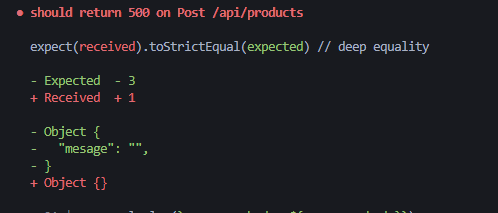
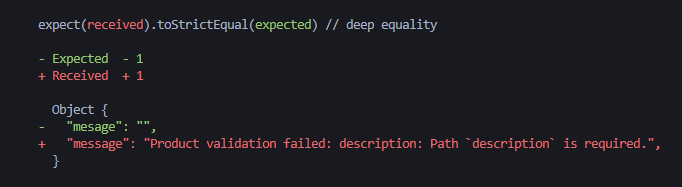

# 04. Create 통합 테스트 작성

## 04-01. 통합 테스트란?

**통합테스트란?**

통합테스트는 모듈을 통합하는 단계에서 수행하는 테스트

단위 테스트를 먼저 수행하여 모듈들이 잘 작동되는 것을 확인했다면, 

모듈들을 연동해 테스트를 수행하는데 이를 통합테스트라 한다.


**why?**

* 모듈들의 상호 작용이 잘 이루어지는지 검증하기 위해

* 통합하는 과정에서 발생할 수 있는 오류를 찾기 위해


※ 단위테스트는 `Jest`를 이용했지만, 통합 테스트는 `Supertest`를 이용하여 테스트를 할 것이다.


**SuperTest란?**

nodejs http 서버를 테스트하기 위해 만들어진 모듈


SuperTest를 이용해 통합 테스트를 구현하는 방법.

```javascript
const request = require('supertest');
const express = require('express');

const app = express();

// 클라이언트에서 들어오는 요청을 처리하는 원본 소스
app.get('/user', (req, res)=>{ 
    res.status(200).json({name: 'john'});
})

// 위의 원본 소스를 위한 통합 테스트 소스
request(app)
  .get('/user')
  .expect('Content-Type', /json/)
  .expect('Content-Length', 15)
  .expect(200)
  .end((err,res)=>{
    if(err) throw err;
})
```


## 04-02. 통합 테스트 작성하기

**해야할 일**

Product 데이터를 database에 넣기

products.js부분을 단위테스트때는 mock함수로 생성해 잘된다 가정하고 진행했지만, 이번엔 실제로 api를 실행해볼꺼다.


먼저, integration폴더를 생성하고, `products.int.test.js`를 생성하자.

app을 가져올때 server.js에서 만든 걸 가져오기 위해 server.js에 export를 해주자.

```javascript
// server.js
...
module.exports = app;
```

```javascript
// test/integration/products.int.test.js
const request = require('supertest');
const app = require('../../server');
```


`/api/products`에 대한 테스트를 작성해보자.

```javascript
// products.js
const productModel = require('../models/Products');
exports.createProduct = async (req, res, next) => {
  try{
    const createdProduct = await productModel.create(req.body)
    console.log('createdProduct', createdProduct);      
    res.status(201).json(createdProduct);
  } catch(error){
    next(error);
  }
};
```


```javascript
it("Post /api/products", async ()=>{
  request(app)
    .post("/api/products")
    .send()
})
```

send에 body를 넘겨줄건데 body값을 새로 선언해서 만들 수도 있지만, 이미만들어놓은 json파일이 있으니 활용하자.

```javascript
const request = require('supertest');
const app = require('../../server');
const newProduct = require("../data/new-product.json");


it("Post /api/products", async ()=>{
  request(app)
    .post("/api/products")
    .send(newProduct)
})
```

몽고db에 저장한 값을 createdProduct로 받아오고있으니 테스트에서도 똑같이 받아오자.

그리고 201이 오는 것과 json형식으로 온것에 대해 확인코드 작성하여 마무리.

```javascript
const request = require('supertest');
const app = require('../../server');
const newProduct = require("../data/new-product.json");


it("Post /api/products", async ()=>{
  const response = await request(app)
        .post("/api/products")
        .send(newProduct)
        expect(response.statusCode).toBe(201)
        expect(response.body.name).toBe(newProduct.name)
        expect(response.body.description).toBe(newProduct.description)
})
```


## 04-03. 에러 처리를 위한 통합 테스트 작성하기

```javascript
// products.js
const productModel = require('../models/Products');
exports.createProduct = async (req, res, next) => {
  try{
    const createdProduct = await productModel.create(req.body)
    console.log('createdProduct', createdProduct);      
    res.status(201).json(createdProduct);
  } catch(error){
    next(error);
  }
};
```


next로 error처리를 하는부분에 대해서 통합 테스트를 작성하자.

```javascript
it("should return 500 on Post /api/products", async ()=>{
  request(app)
    .post('/api/products')
    .send()
})
```

error를 임의로 만들어야 하는 상황이니 description을 빼고 send에 추가해보자.

그리고 statusCode가 500이 오는지 확인.

```javascript
...
it("should return 500 on Post /api/products", async ()=>{
  const response = await request(app)
    .post('/api/products')
    .send({name: "phone"})
  expect(response.statusCode).toBe(500);
})
```


에러 메세지가 어떤 메세지가 오는지 추가해볼건데 우선 어떤 메세지가 오는지 확인해보자.

```javascript
...
it("should return 500 on Post /api/products", async ()=>{
  const response = await request(app)
    .post('/api/products')
    .send({name: "phone"})
  expect(response.statusCode).toBe(500);

  console.log(`response.body: ${response.body}`)

  expect(response.body).toStrictEqual({mesage: ""})
})
```



현재 아무 메세지도 오지 않는것을 볼 수 있다.


## 04-04. Express.js 에러 처리에 대해서

위의 문제를 보기 전에 우선 **Express가 에러 처리를 어떻게 하는지**에 대해서 알아보자.

**참고**

[Express Error Handling 참고](http://thecodebarbarian.com/80-20-guide-to-express-error-handling.html)


```javascript
const app = require('express')();
```

```javascript
// 이렇게 미들웨어에 에러가 발생하면 익스프레스는 이 에러를 에러 처리기(Handler)로 바로 보내줌.
app.get('*', function(req, res, next){
    throw new Error('woops');
})
```

```javascript
// 위 에러가 발생했기 때문에 에러 처리기로 바로 가야 하므로 이 미들웨어는 생략함.
// 왜냐면 이 미들웨어는 에러처리기(Error Handler)가 아니기 때문
app.get('*', function(req, res, next){
    console.log('this will not print');
})
```

```javascript
// 에러 처리기는 이렇게 4가지 인자가 들어감.
// 첫번째 미들웨어에서 발생한 에러 메세지를 이곳에서 처리해줌.
app.use('*', function(error, req, res, next){
	res.json({message: error.message})
})
```

```javascript
app.listen(3000)
```


❗ 원래는 위처럼 에러 처리를 해주면 되지만, **비동기 요청으로 인한 에러**를 이렇게 처리하면 **에러 처리기에서 저 에러 메세지를 받지 못하기 때문에 서버가 Crash**된다

```javascript
const app = require('express')();

app.get('*', function(req, res, next){
    // Will Crash the server on every HTTP request
	setImmediate(()=>{throw new Error('woops'); });
})

app.use('*', function(error, req, res, next){
    // Won't get here, because Exprss doesn't catch the above error
	res.json({message: error.message})
})
app.listen(3000)
```


**how to solve?**

error를 그냥 throw가 아니라 **next에 담아서** 보내면, 알아서 error handler로 보내준다.

```javascript
const app = require('express')();

app.get('*', function(req, res, next){
	// Reporting async errors must go through `next()`
	setImmediate(()=> { next(new Error('woops')); });
})

app.use('*', function(error, req, res, next){
	// Will get here
	res.json({message: error.message})
})
app.listen(3000)
```


작성했던 코드를 다시 살펴보자.

```javascript
// products.js
const productModel = require('../models/Products');
exports.createProduct = async (req, res, next) => {
  try{
    const createdProduct = await productModel.create(req.body)
    console.log('createdProduct', createdProduct);      
    res.status(201).json(createdProduct);
  } catch(error){
    next(error);
  }
};
```

error를 next에 담아 보내주었었지만 왜 빈값이 나왔을까?

=> 아직 error handler를 만들어 주지 않았기 때문.


미들웨어의 가장 마지막에 error handler를 작성해보자.

```javascript
// server.js
...
// Error Handler
app.use((error, req, res, next)=>{
    res.status(500).json({message: error.message});
})


module.exports = app;
```

test해보면 아래와 같이 메세지가 들어오는 것을 확인할 수 있다.



test코드의 message부분에 해당 문구를 붙여넣으면 test를 통과하는 것을 볼 수 있다.

```javascript
// /test/integration/produts.int.test.js
...
it("should return 500 on Post /api/products", async ()=>{
  const response = await request(app)
    .post('/api/products')
    .send({name: "phone"})
  expect(response.statusCode).toBe(500);

  // console.log(`response.body: ${response.body}`)

  expect(response.body).toStrictEqual({message: "Product validation failed: description: Path `description` is required."})
})
```


> ❗ 어떻게 에러가 처리되는지 흐름을 잘 기억하자.
>
> 1. test에서 request를 보냄.
> 2. 보낸 request를 controller(products.js)에서 처리를 하려 했는데, body의 required가 true인 description이 없어 error발생.<br/>생성된 error는 next에 담아 처리.
> 3. 미들웨어(server.js)에서 작성한 Error Handler의 error파라미터에 담겨 에러처리.<br/>
>
> ```javascript
> // Error Handler
> app.use((error, req, res, next)=>{
>     res.status(500).json({message: error.message});
> })
> ```
>
> 위의 부분이 아래 두 줄로 처리가 된다.
>
> ```javascript
> expect(response.statusCode).toBe(500);
> expect(response.body).toStrictEqual({mesage: ""})
> ```
>
> 