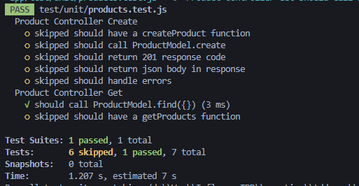

# 05. Read

## 05-01. Read 시작

 Create때 넣어준 데이터를 가져와 읽는 부분을 해볼 것이다.

**해야할 일**

database에 있는 Prodcut 데이터를 가져오는것.

Product를 가져오기 위한 함수를 먼저 생성해야 한다.


먼저 getProducts라는 메서드를 만들 것을 예상하고 testcode를 작성.

```javascript
// test/unit/products.test.js
describe("Product Controller Get", ()=>{
  it("should have a getProducts function", ()=>{
    expect(typeof productController.getProducts).toBe("function")
  })
})
```

```javascript
// controller/products.js
const productModel = require('../models/Products');
...
exports.getProducts = async (req, res, next) =>{
  
}
```


## 05-02. getProducts 단위 테스트 작성(1)

getProducts부분을 완성하기 전에 단위테스를 작성해보자.

`find`라는 메서드를 이용할 것이다.

`it("should call ProductModel.find({})")`

이런 식으로 find에 빈 값을 사용하게 되면, **Product  Collection안의 모든 값을 조건 없이 가져오겠다는 뜻.**

```javascript
// test/unit/products.test.js
describe("Product Controller Get", ()=>{
  ...
  it("should call ProductModel.find({})", async ()=>{
    await productController.getProducts(req, res, next);
    expect(productModel.find).toHaveBeenCalledWith({})
  })
})
```

`toHaveBeenCalledWith()` 어떤 것과 함께 호출되는지 테스트 하는 것.

> ❗ 추천 Extension
>
> Jest Runner를 설치하게되면 각 테스트 상단에 해당 테스트만 Run할 수 있는 Run버튼이 생김


test시 에러나지 않게 controller부분을 작성해보자.

```javascript
// controller/products.js
const Product = require('../models/Products');
const productModel = require('../models/Products');
...
exports.getProducts = async (req, res, next) =>{
  await Product.find({})
}
```

하지만 test해보면 fail이 계속뜰것이다.


**why?**

create의 경우 mock function을 이용해서 계속 create를 관찰하게끔 만들었다.

productModel.find는 그러지 않아서 에러가 발생한 것.

mock함수를 작성해주면 통과하는 것을 볼 수 있다.

```javascript
// test/unit/products.js
const productController = require("../../controller/products");
const productModel = require("../../models/Products");

const httpMocks = require("node-mocks-http");
const newProduct = require("../data/new-product.json");

productModel.create = jest.fn();
productModel.find = jest.fn();
...
describe("Product Controller Get", ()=>{
  it("should have a getProducts function", ()=>{
    expect(typeof productController.getProducts).toBe("function")
  })

  it("should call ProductModel.find({})", async ()=>{
    await productController.getProducts(req, res, next);
    expect(productModel.find).toHaveBeenCalledWith({})
  })
})
```





## 05-03. getProducts 단위 테스트 작성(2)

이제 성공했을 때 status를 200으로 보내보자.

먼저 테스트 코드 작성!

```javascript
// test/unit/products.test.js
...
describe("Product Controller Get", ()=>{
  ...
  it("should return 200 response", async () =>{
    await productController.getProducts(req, res, next);
    expect(res.statusCode).toBe(200);
    expect(res._isEndCalled).toBeTruthy();
  })
})
```

```javascript
// controller/products.js
const Product = require('../models/Products');
const productModel = require('../models/Products');
...getProducts = async (req, res, next) =>{
  await Product.find({})
  res.status(200).send();
}
```

※ testcode작성 한 것을 보면, create때 한 것을 반복하는걸 볼 수 있다.


db에서 가져온 데이터를 client에 전달해주자.

여기서 find를 임의로 결과값을 만들어 줘야한다.

(왜냐면 지금은 단위테스트기 때문에 다른 종속성에 영향을 받지 않기 위해서)

```javascript
it("should return json body in response", async () => {
	productModel.find.mockReturnValue()
  })
```

임의의 값은 `new-product.json`처럼 파일을 하나 새로 만들어주자.

```javascript
// test/data/all-product.json
[
  {
    "name": "Gloves",
    "description": "good to wear",
    "price": 15
  },
  {
    "name": "Gloves",
    "description": "good to wear",
    "price": 14
  },
  {
    "name": "Gloves",
    "description": "good to wear",
    "price": 13
  }
]
```


그리고 test파일에서 new-product처럼 all-product를 만들어 넣어주자.

```javascript
const productController = require("../../controller/products");
const productModel = require("../../models/Products");

const httpMocks = require("node-mocks-http");
const newProduct = require("../data/new-product.json");
const allProduct = require("../data/all-product.json");
...

describe("Product Controller Get", ()=>{
  ...
  it("should return json body in response", async () => {
    productModel.find.mockReturnValue(allProduct);
    await productController.getProducts(req, res, next);
    expect(res._getJSONData()).toStrictEqual(allProducts)
  })
})
```

실제 대응하는 코드를 작성해보자.

```javascript
// controller/products.js
const Product = require('../models/Products');
const productModel = require('../models/Products');
...
exports.getProducts = async (req, res, next) =>{
  const allProduts = await Product.find({})
  res.status(200).json(allProduts);
}
```

test하면 통과하는 것을 볼 수 있다.


## 05-04. getProducts 에러 처리 단위 테스트 작성

Product데이터를 가져올 때 에러나면 그에 맞는 에러처리를 해주자.

단위테스트 작성전에 create때 한 것을 다시 보자.

```javascript
it("should handle errors", async ()=>{
    const errorMessage = {message: "description property missing"}; // mongo db에서 전달할 메세지를 임의로 생성
    const rejectedPromise = Promise.reject(errorMessage);
    productModel.create.mockReturnValue(rejectedPromise);
    await productController.createProduct(req, res, next);
    expect(next).toBeCalledWith(errorMessage);
  })
```

어떠한 이유때문에 에러가 날 것이란 것을 message를 지정해놓고,  

`Promise.reject`를 이용해서 에러메세지를 전달.<br/> (mongodb가 비동기로 response를 주기 때문에) 

그럼 controller의 products.js에서 reject가 왔기 때문에 catch에 작성된 next에 error가 전달된다.

그 이유는 reject에 message를 넣어 주었기 떄문. 그래서 toBeCalledWith가 통과하는 것을 알 수 있다.


이제 getProduts에 대해서 작성해보자.

```javascript
// test/unit/products.js
it("should handle errors", async () =>{
    const errorMessage = {message: "Error finding product data"};
    const rejectedPromise = Promise.reject(errorMessage);
    productModel.find.mockReturnValue(rejectedPromise);
    await productController.getProducts(req, res, next);
    expect(next).toHaveBeenCalledWith(errorMessage)
})
```

```javascript
// controller/products.js
const Product = require('../models/Products');
const productModel = require('../models/Products');
...

exports.getProducts = async (req, res, next) =>{
  try{
    const allProduts = await Product.find({})
    res.status(200).json(allProduts);
  }catch(error){
    next(error);
  }
}
```


## 05-05. getProducts 통합 테스트 작성

단위 테스트들이 잘 연동이되서 돌아가는지 통합 테스트를 작성해보자.

```javascript
// test/integration/products.int.test.js
it("GET /api/products", async ()=>{
  const response = await request(app).get("/api/products")
  expect(response.statusCode).toBe(200);
  expect(Array.isArray(response.body)).toBeTruthy();
  expect(response.body[0].name).toBeDefined();
  expect(response.body[0].description).toBeDefined();
})
```

test하면 에러가 날것인데, 그 이유는 route에 설정해주지 않았기 때문.

```javascript
// routes/js
const express = require('express');
const router = express.Router();
const productController = require('./controller/products');

router.post('/', productController.createProduct)
router.get('/', productController.getProducts);
module.exports = router;
```

test시 정상 동작하는 것을 볼 수 있다.


## 05-06. getProductById 단위 테스트 작성(1)

getProductById는 iㅇ를 이용해서 특정 Product의 데이터만 가져올 것이다.

새로운 describe를 작성!

```javascript
// test/unit/products.test.js
describe("Product Controller GetById", () => {
  it("should have a getProductById", () =>{
    expect(typeof productController.getProductById).toBe("function");
  })
})

// controller/products.js
exports.getProductById = async (req, res, next) =>{
  
}
```


내용을 채워보자.

getProductById함수를 호출할 때 Product Model의 findById 메소드를 route parameter와 함께 호출하기

```javascript
// test/unit/products.test.js
const productController = require("../../controller/products");
const productModel = require("../../models/Products");

const httpMocks = require("node-mocks-http");
const newProduct = require("../data/new-product.json");
const allProduct = require("../data/all-product.json");

productModel.create = jest.fn();
productModel.find = jest.fn();
productModel.findById = jest.fn();

const PRODUCT_ID = "213125asdasdqwe";

.

describe("Product Controller GetById", () => {
  it("should have a getProductById", () =>{
    expect(typeof productController.getProductById).toBe("function");
  })

  it("should call productModel.findById", async ()=>{
    req.params.productId = PRODUCT_ID;
    await productController.getProductById(req, res, next);
    expect(productModel.findById).toBeCalledWith(PRODUCT_ID);
  })
})
```

대응하는 코드

```javascript
const Product = require('../models/Products');
const productModel = require('../models/Products');
...

exports.getProductById = async (req, res, next) =>{
  await productModel.findById(req.params.productId);
}
```


## 05-07. getProductById 단위 테스트 작성(2)

json이나 status를 리턴해주는 부분 작성

```javascript
it("should return json body and response code 200", async ()=>{
    productModel.findById.mockReturnValue();
})
```

여기서 하나의 데이터만 가져오는 것이니 까 지난번에 사용한 newProduct를 사용

```javascript
// test/unit/products.test.js
it("should return json body and response code 200", async ()=>{
    productModel.findById.mockReturnValue(newProduct);
    await productController.getProductById(req, res, next)
    expect(res.statusCode).toBe(200);
    expect(res._getJSONData()).toStrictEqual(newProduct)
    expect(res._isEndCalled()).toBeTruthy();
})
```

대응 코드

```javascript
exports.getProductById = async (req, res, next) =>{
  const product = await productModel.findById(req.params.productId);
  res.status(200).json(prdocut);
}
```


**Id에 맞는 데이터가 없는 경우 404 STATUS를 전달해보자.**

``` javascript
it("should return 404 when item doesnt exist", async ()=>{
    productModel.findById.mockReturnValue(null); // data가 없으니 null리턴 할 것임.
    await productController.getProductById(req, res, next);
    expect(res.statusCode).toBe(404);
    expect(res._isEndCalled()).toBeTruthy();
  })
```

```javascript
// controller/product.js
exports.getProductById = async (req, res, next) =>{
  const product = await productModel.findById(req.params.productId);
  if(product){
    res.status(200).json(product);
  }else{
    res.status(404).send();
  }
}
```


마지막으로 **error처리**를 해보자.

```javascript
// test/unit/products.test.js
it("should handle errors", async () =>{
    const errorMessage = {message: "error"};
    const rejectedPromise = Promise.reject(errorMessage);
    productModel.findById.mockReturnValue(rejectedPromise);
    await productController.getProductById(req, res, next);
    expect(next).toHaveBeenCalledWith(errorMessage);
  })
```

```javascript
// controller/products.js
exports.getProductById = async (req, res, next) => {
  try {
    const product = await productModel.findById(req.params.productId);
    if (product) {
      res.status(200).json(product);
    } else {
      res.status(404).send();
    }
  } catch (error) {
    next(error);
  }
};
```


## 05-08. getProductById 통합 테스트 작성(1)

id값을 route parameter로 받아오니 router부터 추가하자.

```javascript
// routes.js
...
router.get('/:productid', productController.getProductById)
```


통합 작성

```javascript
it("GET /api/product/:productId", async ()=>{
  const response = await request(app).get("/api/products/")
```

products뒤에 이제 id를 넣어주어야하는데 이떄 실제값중 하나를 넣어주어야한다.

단위 테스트때는 몽고db가 잘 작동된다고 가정하고 작성하기 때문에 임의로 작성했지만,

통합 테스트때는 몽고db를 통해서 요청이 이뤄지므로 실제 값을 넣어주어야한다.

db에서 id값 하나를 긁어 넣어주어도 되지만, 좀 더 dynamic하게 작성해보자.


**how?**

변수 하나를 두고, 이전에 작성한 `/api/products`를 테스트할 때 첫 번째 요소를 받는 것이다.

```javascript
const request = require('supertest');
const app = require('../../server');
const newProduct = require("../data/new-product.json");

let firstProduct;

...

it("GET /api/products", async ()=>{
  const response = await request(app).get("/api/products")
  expect(response.statusCode).toBe(200);
  expect(Array.isArray(response.body)).toBeTruthy();
  expect(response.body[0].name).toBeDefined();
  expect(response.body[0].description).toBeDefined();
  firstProduct = response.body[0];
})


it("GET /api/product/:productId", async ()=>{
  const response = await request(app).get(`/api/products/${firstProduct._id}`)
  expect(response.statusCode).toBe(200);
  expect(response.body.name).toBe(firstProduct.name);
  expect(response.body.description).toBe(firstProduct.description);
})
```

> ❗ 주의!!
>
> getProductId를 할 때는 테스트 시 해당 테스트만 돌리면 안된다.
>
> 왜냐면 get all products할 때 firstProduct의 값이 생기기 때문.


## 05-09. getProductById 통합 테스트 작성(2)

Id에 대한 데이터가 없을때 코드를 작성해보자.

이때 id코드값은 임의로 입력해버리면 몽고db가 id형태가 유효하지않다고 500 error를 발생시킴.

그래서 실제 코드에서 끝에만 조금 변경하여 테스트.

```javascript
...
it("Get id doesnt exist /api/product/:productId", async()=>{
  const response = await request(app).get('/api/products/63cfaf90f5bc045472cb2577')
  expect(response.statusCode).toBe(404);
})
```

